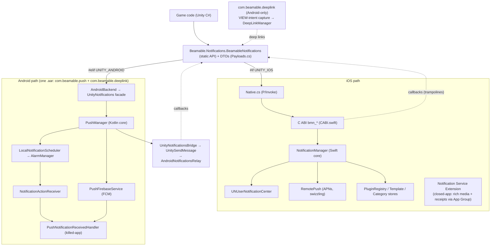

# Beamable Native Notification Libraries — Reference

Engine-agnostic native notification + deep-link libraries for **Android** and **iOS**, plus a single
shared **Unity C# package** that exposes one cross-platform API over both. The two platforms are
first-class equals: every topic below documents **how Android does it** and **how iOS does it**
side by side, and §3 lists the API/feature parity in full.

| Component | Location | Purpose |
|---|---|---|
| Android BeamableNotifications | `Android/BeamableNotifications` — one module `notifications`, one `.aar` | **Push** (`com.beamable.push`): local notifications (AlarmManager) + optional remote push (FCM), channels/templates, permission, launch-intent reading, and a **receive-time handler** that runs even when the app is killed. **Deep links** (`com.beamable.deeplink`): native `VIEW`-intent capture (cold + warm start). |
| iOS BeamableNotifications | `iOS/BeamableNotifications` (Swift) | Local + remote (APNs) notifications, permission, templates, action categories, rich media + closed-app analytics via a Notification Service Extension, plus a plugin system. Exposes a C ABI (`bmn_*`). |
| Shared Unity package | `EnginePlugins/Unity` (`Beamable.Notifications`, C#) | **One API for both platforms** — `BeamableNotifications` + DTOs; routes to the iOS C ABI or the Android facade under the hood. **This is what Unity game code uses.** |
| Unreal plugin | `EnginePlugins/Unreal` (`BeamPlatformNotifications`, C++) | Cross-platform UE plugin wrapping the same iOS C ABI / Android facade; native binaries ship under `ThirdParty/` (staged by `dev-native.sh`). Installed into a UE project via `install-beamplatformnotifications.sh`. |

Toolchains — Android: AGP 8.1.4 / Gradle 8.2 / Kotlin 1.9.22 / compileSdk 34 / minSdk 24 / Java 11.
iOS: Swift 5, iOS 14+ deployment target (the core is a Swift Package; ships as an xcframework).

> **Reading order:** most Unity consumers only need §1 (mental map), §3 (parity), and §13 (the shared
> Unity package). §4–§11 explain each feature per platform; §12 is the per-platform class/file
> reference; §14–§15 cover other engines and building.
>
> **Feature reference:** for the design behind the multi-handler model, intent-data schema, and the
> analytics funnel (auth + persist-and-replay), see [`docs/notifications-feature.md`](docs/notifications-feature.md).

---

## 1. Mental map

One shared C# API sits on top of two native libraries. Game code calls **down**; events flow back
**up** to the same C# events.



**Legend:** solid arrows **down** = calls (engine → native); dotted arrows **up** = events
(native → engine). iOS routes through the `bmn_*` **C ABI**; Android routes through the
`UnityNotifications` **facade** — both carry the **same DTO JSON** (§3). The `com.beamable.deeplink`
half (same Android `.aar`) is an Android-only extra; its links also surface the iOS way via
`NotificationData.DeepLink`.

---

## 2. Design model

Each native library is an **engine-agnostic core** wrapped by thin per-engine adapters. The shared
Unity C# layer then unifies both natives behind one API.

### Android

Structured in three layers, and **ships every engine adapter inside the one `.aar`** (`unity/`,
`unreal/`, `react/`). Adapters for engines you don't use are simply never loaded.

```
            engine (C# / C++ / JS)
   inbound  │   ▲  outbound
            ▼   │
   ┌─────────────────────────┐   ← per-engine adapter (thin)
   │  *Notifications / *DeepLink     inbound:  @JvmStatic facade the engine calls
   │  *Bridge                        outbound: implements the core listener, forwards events
   └─────────────────────────┘
            │   ▲
            ▼   │
   ┌─────────────────────────┐   ← engine-agnostic CORE (no engine references)
   │  PushManager / DeepLinkManager  (facade)
   │  PushListener / DeepLinkListener (callbacks)
   └─────────────────────────┘
```

- **Inbound (engine → core):** a per-engine `@JvmStatic` facade (`UnityNotifications`, `UnrealPush`,
  `ReactPushModule`, …) taking only strings/primitives, resolving the activity natively.
- **Outbound (core → engine):** a per-engine bridge that implements the core listener and delivers
  events back — the *only* part that is genuinely engine-specific (different transport per engine).
- **Core:** never references any engine; the same code serves all three.

### iOS

The same shape — a Swift core (`NotificationManager`) is the engine-agnostic centre, the C ABI
(`bmn_*`, `CABI.swift`) is the inbound facade, and callback function-pointers are the outbound path.
A companion **Notification Service Extension** handles rich media + closed-app analytics in a
separate process, and **AppDelegate swizzling** captures APNs tokens with no manual wiring.

### Shared Unity layer

Above both natives, the shared **Unity C# package** (§13) is a single API that picks the right native
at **compile time** (`#if UNITY_IOS` / `#elif UNITY_ANDROID`). For Unity, that C# layer *is* the
engine adapter — game code never touches the native facades directly.

---

## 3. Cross-platform parity

The libraries deliberately expose **one identical surface** on iOS and Android: the same C# method
signatures, the same events, and the same DTOs (serialized to the **same JSON** for both natives).
Game code is **write-once** — the platform is chosen at compile time. Where a capability has no
native equivalent on a platform (mostly iOS-only features on Android), the method is kept but is
**best-effort / no-op** so it is never *absent* and never throws.

### API methods

`Beamable.Notifications.BeamableNotifications.*` → iOS C ABI (`bmn_*`) → Android facade
(`com.beamable.push.unity.UnityNotifications.*`).

| C# method | iOS (`bmn_*`) | Android (`UnityNotifications`) | Parity |
|---|---|---|---|
| `Initialize()` | `bmn_initialize` | `initialize` | ✓ both |
| `RequestPermission(PermissionOptions)` | `bmn_requestPermission` | `requestPermission` (iOS-only option fields ignored) | ✓ both |
| `GetPermissionStatus()` | `bmn_getPermissionStatus` | `getPermissionStatus` | ✓ both |
| `ScheduleLocal(LocalRequest)` | `bmn_scheduleLocal` | `scheduleLocal` (maps trigger → AlarmManager) | ✓ both |
| `CancelLocal(string id)` | `bmn_cancelLocal` | `cancelLocal` (string id → stable int) | ✓ both |
| `CancelAllLocal()` | `bmn_cancelAllLocal` | `cancelAllLocal` | ✓ both |
| `GetPending()` | `bmn_getPending` | `getPending` → emits empty list | ≈ Android empty |
| `RegisterForRemote()` | `bmn_registerForRemote` | `registerForRemote` (`fetchToken`) | ✓ both |
| `UnregisterForRemote()` | `bmn_unregisterForRemote` | `unregisterForRemote` (no-op; FCM self-manages) | ≈ Android no-op |
| `ConfigureAuth(accessToken, refreshToken, expiresAtMs, cid, pid, host)` | `bmn_configureAuth(json)` | `configureAuth(json)` | ✓ both — persists the player bearer token for the native funnel (`docs/notifications-feature.md` §4.3) |
| `GetDeliveryReceipts()` | `bmn_getDeliveryReceipts` | `getDeliveryReceipts` → emits empty list | ≈ iOS-only |
| `RegisterTemplate(TemplateSpec)` | `bmn_registerTemplate` | no-op | ≈ iOS-only |
| `RegisterCategory(CategorySpec)` | `bmn_registerCategory` | no-op | ≈ iOS-only |
| `SetBadge(int)` | `bmn_setBadge` | no-op | ≈ iOS-only |
| `ClearDelivered()` | `bmn_clearDelivered` | `clearDelivered` (`cancelAll`) | ✓ both |
| `GetLaunchNotification() → NotificationData` | `bmn_getLaunchNotification` | `getLaunchNotification` | ✓ both |

### Events

Identical names on both platforms (raised on the Unity main thread). iOS feeds them via
`bmn_setOn*` callback trampolines; Android feeds them via `UnitySendMessage` →
`AndroidNotificationsRelay`.

| C# event | Payload | iOS source | Android source |
|---|---|---|---|
| `OnPermissionResult` | `PermissionResult` | `bmn_setOnPermissionResult` | `OnPermissionResult` msg |
| `OnTokenReceived` | `string` | `bmn_setOnTokenReceived` | `OnTokenReceived` msg (`{token}`) |
| `OnTokenError` | `string` | `bmn_setOnTokenError` | `OnTokenError` msg (`{error}`) |
| `OnNotificationReceived` | `NotificationData` | `bmn_setOnNotificationReceived` | `OnNotificationReceived` msg |
| `OnNotificationTapped` | `NotificationData` | `bmn_setOnNotificationTapped` | `OnNotificationTapped` msg |
| `OnNotificationPresented` | `NotificationData` | `bmn_setOnNotificationPresented` | *(no Android source — iOS-only at runtime)* |
| `OnPendingNotifications` | `List<NotificationData>` | `bmn_setOnPendingNotifications` | emits `[]` *(iOS-only at runtime)* |
| `OnDeliveryReceipts` | `List<DeliveryReceipt>` | `bmn_setOnDeliveryReceipts` | emits `[]` *(iOS-only at runtime)* |

### Features

| Feature | iOS | Android |
|---|---|---|
| Local notifications (immediate / interval / calendar) | ✓ `UNUserNotificationCenter` triggers | ✓ AlarmManager (+ exact + UTC/local options) |
| Remote push | ✓ APNs | ✓ FCM (optional, needs `google-services.json`) |
| Runtime permission | ✓ alert/badge/sound/provisional/critical/carPlay | ≈ `POST_NOTIFICATIONS` only (API 33+) |
| Launch notification ("get intent") | ✓ | ✓ |
| Events: received / tapped | ✓ | ✓ |
| Event: presented (foreground `willPresent`) | ✓ | ✗ (no equivalent) |
| Templates / action categories | ✓ | ✗ no-op |
| Closed-app analytics + delivery receipts | ✓ (NSE + App Group) | ✗ no-op |
| Badge / pending-list query | ✓ | ✗ no-op / empty |
| Receive-time handler (runs while killed) | ✓ (NSE) | ✓ (`PushNotificationReceivedHandler`) |
| Raw URL-scheme deep links (not from a notification) | ✗ | ✓ (`com.beamable.deeplink`) |

**Shared DTOs** (`Payloads.cs`, Newtonsoft-serialized, nulls omitted): `NotificationData`
(`Id`/`Title`/`Body`/`Subtitle`/`DeepLink`/`ActionId`/`WasLaunch`/`UserInfo`), `LocalRequest`,
`TriggerSpec` (`Type` = `immediate`/`timeInterval`/`calendar`, plus `TriggerSpec.After(seconds)`),
`PermissionOptions`/`PermissionResult`, `TemplateSpec`, `ActionSpec`/`CategorySpec`,
`AuthCredentials` (§4.3), `NotificationIntentData`/`NotificationOffer` (§3.3), `DeliveryReceipt`.

---

## 4. Initialization & permissions

Call `Initialize()` once at startup, then `RequestPermission(...)`; the result arrives on
`OnPermissionResult`. `GetPermissionStatus()` re-emits the current status.

### Android
- `UnityNotifications.initialize(gameObject)` spawns the outbound bridge, calls
  `PushManager.initialize(context, bridge, enableRemote = true)`, seeds `isForeground = true`, and
  registers a default high-importance channel (API 26+).
- Permission is the **`POST_NOTIFICATIONS`** runtime permission (API 33+), handled by
  `PermissionHelper` via `PushManager.requestPermission(activity)`; `getPermissionStatus()` reports
  `PushManager.hasPermission(activity)`. iOS-only option fields (alert/badge/sound/…) are ignored.

### iOS
- `bmn_initialize` makes `NotificationManager.shared` the `UNUserNotificationCenter` delegate (it
  re-asserts this on each op, since a host engine may steal it during launch) and flushes any queued
  cold-start tap.
- `bmn_requestPermission(optionsJson)` requests the authorization options carried in
  `PermissionOptions` (alert / badge / sound / provisional / critical / carPlay); `PermissionResult`
  carries the granted set. `bmn_getPermissionStatus` reports current authorization.

---

## 5. Local notifications & scheduling

`ScheduleLocal(LocalRequest)` with a `TriggerSpec` — `immediate`, `timeInterval` (seconds), or
`calendar` (date components). `CancelLocal(id)` / `CancelAllLocal()` remove scheduled ones.

### Android
- `UnityNotifications.scheduleLocal(json)` parses the `LocalRequest`, maps the trigger, and calls
  `PushManager` → `LocalNotificationScheduler`, which sets an **`AlarmManager`** alarm whose
  broadcast targets `NotificationActionReceiver` (it posts the notification via `NotificationBuilder`
  on fire). Trigger mapping: `immediate` → delay 0; `timeInterval` → `scheduleLocal(json, seconds*1000)`;
  `calendar` → `scheduleLocalAt(json, year, month, day, hour, minute, second, useUtc=false, exact=false)`.
- **Inexact by default** (doze-friendly, no permission). Opt-in **exact** scheduling
  (`PushManager.scheduleLocalExact` / `scheduleLocalAt(..., exact=true)`) uses
  `setExactAndAllowWhileIdle`; exact alarms need `SCHEDULE_EXACT_ALARM` (API 33+ user-granted) — the
  library checks `canScheduleExactAlarms()` and **falls back to inexact** (with a
  `schedule_exact_denied` warning) otherwise. Absolute-time scheduling offers a **local-vs-UTC** choice.
- `CancelLocal` maps the string id to a **stable int** (so it targets the same AlarmManager id);
  `clearDelivered` / `CancelAllLocal` both call `cancelAll`.

### iOS
- `bmn_scheduleLocal(requestJson)` builds a `UNNotificationRequest`. Trigger types: `immediate`
  (no trigger), `timeInterval` (`UNTimeIntervalNotificationTrigger`), `calendar`
  (`UNCalendarNotificationTrigger` from date components). Any `templateId`/`templateValues`
  (`TemplateStore`) and `categoryId` (`CategoryStore`) are resolved before scheduling.
- `bmn_cancelLocal(id)` / `bmn_cancelAllLocal` remove pending requests; `bmn_getPending` →
  `OnPendingNotifications`.

---

## 6. Remote push & tokens

`RegisterForRemote()` requests a device token (delivered on `OnTokenReceived`, or `OnTokenError`);
`UnregisterForRemote()` detaches. Remote is optional on both platforms.

### Android (FCM)
- Auto-enabled **only when a `google-services.json` is present**; otherwise the library runs
  **local-only** and token/topic calls become no-ops. `registerForRemote` → `PushManager.fetchToken`;
  `unregisterForRemote` is a no-op (FCM manages its own registration).
- `PushFirebaseService` (a `FirebaseMessagingService`) is the entry point: `onNewToken` →
  `OnTokenReceived`; `onMessageReceived` invokes the receive-time handler, then forwards to the engine
  (foreground) or displays data-only messages (background).

### iOS (APNs)
- `bmn_registerForRemote` registers with APNs. `RemotePush` installs **AppDelegate swizzling** to
  capture the device token (`onTokenReceived`, hex) / failures (`onTokenError`) and silent pushes —
  no manual AppDelegate edits (opt out with `BMNDisableSwizzling`).

---

## 7. Events, callbacks & launch intent

The full event set (§3) plus the launch notification. `GetLaunchNotification()` returns the
`NotificationData` that opened the app (or null).

### Android
- The outbound `UnityNotificationsBridge` (a `PushListener`) maps core callbacks to iOS-shaped
  `UnitySendMessage` calls: foreground message → `OnNotificationReceived`, tap → `OnNotificationTapped`,
  token → `{token}`, error → `{error}`, permission → `PermissionResult` JSON. There is **no foreground
  `presented` event** on Android.
- `getLaunchNotification()` reads the launch intent once via `PushManager.consumeLaunchIntent` and
  builds a `NotificationData` (`wasLaunch = true`); `IntentDataReader` extracts the payload.

### iOS
- Foreground delivery (`willPresent`) fires `OnNotificationPresented` **and** `OnNotificationReceived`
  and asks plugins for presentation options. **Taps** (`didReceive`) fire `OnNotificationTapped`
  (carrying `actionId` + `deepLink`); a cold-start tap is queued by `LaunchTracker` and flushed once
  the engine registers its callback, and recorded as the launch notification.
- `bmn_getLaunchNotification()` returns a malloc'd JSON string (free with `bmn_free`) — handled for
  you by the C# wrapper.

---

## 8. Templates, categories & badge

`RegisterTemplate(TemplateSpec)`, `RegisterCategory(CategorySpec)`, `SetBadge(int)`. **iOS-only at
runtime** — kept on Android as no-ops for a uniform surface (§3).

### Android
- `registerTemplate` / `registerCategory` / `setBadge` are **no-ops** (no native equivalent). Android
  does have notification **channels** (registered automatically at init), which iOS lacks.

### iOS
- `TemplateStore` resolves `templateId`/`templateValues` into title/body/etc. before scheduling;
  `CategoryStore` registers `UNNotificationCategory` action buttons (rendered when a matching
  `categoryId` is scheduled). `bmn_setBadge` sets the app icon badge.

---

## 9. Analytics funnel & delivery receipts (closed-app)

Campaign notifications report a five-stage funnel (Sent / Received / Opened / Clicked / Converted) by
POSTing Beamable `CoreEvent`s directly from native code — so events fire even when the engine VM is
dead. There is **no** `configureAnalytics`/webhook surface; the funnel authenticates with the
player's persisted bearer token written via `ConfigureAuth(AuthConfig)` / `bmn_configureAuth` and
POSTs to `/report/custom_batch/{cid}/{pid}/{gamerTag}`. On an unrecoverable auth/transport failure the
event is persisted and auto-replayed on the next connect. See `docs/notifications-feature.md` §4 for
the full model (gating, auth, persist-and-replay, payloads, offer helpers).

### Android
- The funnel runs natively (received from `PushFirebaseService`, opened from
  `NotificationActionReceiver`). Auth is persisted via `PushManager.configureAuth` into the
  `beamable_notifications_auth` prefs and read by `BeamableAnalytics`. Delivery receipts are no-op /
  empty list on Android; the "ran while killed" capability is the **receive-time handler** (§10).

### iOS
- A **Notification Service Extension** runs in a separate process on **every** remote push (including
  app-killed), attaches rich media, fires the **Received** funnel event (`AnalyticsServicePlugin`),
  and writes **delivery receipts** into an **App Group** (`SharedConfig`). Auth (`AuthConfig`) is
  persisted in the same App Group via `bmn_configureAuth` (read by both app + NSE); the app replays
  receipts via `bmn_getDeliveryReceipts` → `OnDeliveryReceipts`, and pending funnel events are flushed
  on connect.

---

## 10. Receive-time handler (runs even when the app is killed)

A native hook that fires the moment a push arrives — **foreground, background, AND killed** — with no
engine running. Engine-side `OnNotification*` events require the engine to be alive, so they only
cover the **app-open** case; this is the only hook that also runs killed.

### Android
Implement `com.beamable.push.PushNotificationReceivedHandler` and register it via app-manifest
meta-data (instantiated by **reflection**, so it runs in a freshly spawned process when killed).
**Multiple handlers are supported** (`docs/notifications-feature.md` §1.1): declare each with the
shared key used as a prefix (`…notification_received_handler`, `…notification_received_handler.1`,
`….2`), and/or register at runtime via `PushManager.addNotificationReceivedHandler(...)` /
`removeNotificationReceivedHandler(...)`. Manifest handlers always participate; each handler's failure
is isolated.

```xml
<meta-data android:name="com.beamable.push.notification_received_handler"
           android:value="your.fully.Qualified.Handler" />
<meta-data android:name="com.beamable.push.notification_received_handler.1"
           android:value="your.fully.Qualified.SecondHandler" />
```
```kotlin
interface PushNotificationReceivedHandler {
    fun onNotificationReceived(context: Context, event: PushReceivedEvent)
}
```
- Fires for **local** (no Firebase needed, via `NotificationActionReceiver`) and **remote** FCM;
  `event.wasForeground` distinguishes app-open from background/killed.
- Runs on a **background thread (~10s budget)** — a short blocking call is fine; otherwise enqueue
  WorkManager. Requires the no-arg public constructor.
- For remote **background/killed**, send **data-only, high-priority** FCM messages (a
  `notification`-block message is auto-shown by the OS and only reaches the app on tap).
- The Unity package generates a sample handler file for you to customize (it no longer auto-wires a
  demo handler — see `docs/notifications-feature.md` §5.2 / §5.4).

### iOS
The closed-app equivalent is the **Notification Service Extension** (§9): it runs per remote push even
when killed, can mutate content and record analytics/receipts to the App Group. There is no separate
"handler class" to register — extend the NSE (or a service plugin) to run code at receive time.

---

## 11. Deep links

A notification-carried deep link surfaces the same way on both platforms: `NotificationData.DeepLink`
on `OnNotificationReceived` / `OnNotificationTapped`.

### Android
- Beyond notification links, the **`com.beamable.deeplink`** half of the Android library captures raw
  **`VIEW`-intent** URL-scheme links (e.g. `beamable://…`) for **cold start** (`getInitialLink`) and
  **warm start** (`onNewIntent`, de-duped). The consuming app declares the scheme; the library carries
  none. In notifications, `deepLinkUrl` is carried via `dataPayload["deeplink"]`.

### iOS
- No raw URL-scheme capture in this API — deep links come **only** through notifications, exposed via
  `NotificationData.DeepLink` (taps carry it alongside `actionId`).

---

## 12. Native internals reference

### Android — class tables

> All of the below compile into **one module** (`notifications`, namespace `com.beamable.notifications`)
> → one `beamable-notifications-release.aar`, under `Android/BeamableNotifications/`. The push and
> deep-link halves keep their original `com.beamable.push.*` / `com.beamable.deeplink.*` packages.

**Push core — `…/com/beamable/push/`**

| File | Type | Purpose / key API |
|---|---|---|
| `PushManager.kt` | `object` | Public facade. `initialize`, `registerChannel(spec)` / `registerChannel(id, name, description, importance)`, `requestPermission`, `hasPermission`, `scheduleLocal(template/json, delayMillis)→id`, `scheduleLocalExact(...)→id` (exact alarm), `scheduleLocalAt(..., year, month, dayOfMonth, hourOfDay, minute, second, useUtc, exact)→id` (absolute, local/UTC), `canScheduleExactAlarms()`, `requestExactAlarmPermission(activity)`, `cancel(id)`, `cancelAll`, `fetchToken`, `subscribeTopic`/`unsubscribeTopic`, `consumeLaunchIntent`, `addNotificationReceivedHandler`/`removeNotificationReceivedHandler`, `resolveHandlers`, `configureAuth`/`clearAuth`; state: `listener`, `isForeground`, `remoteEnabled`. |
| `PushListener.kt` | `interface` | App-alive callbacks: `onTokenReceived`, `onTokenRefreshError`, `onMessageReceivedForeground`, `onNotificationOpened`, `onPermissionResult`, `onLocalNotificationScheduled`, `onError(stage,message)`. |
| `PushNotificationReceivedHandler.kt` | `interface` | **The receive-time hook.** `onNotificationReceived(context, event)` — runs for local+remote, all states (incl. killed). |
| `PushReceivedEvent.kt` | `data class` | Snapshot: `messageId?`, `dataJson`, `sentTimeMillis`, `receivedTimeMillis`, `wasForeground`, `deepLink?`. |
| `PushFirebaseService.kt` | `FirebaseMessagingService` | FCM entry point. `onNewToken`, `onMessageReceived` → invokes handler, then foreground-forward or data-message display. |
| `LocalNotificationScheduler.kt` | `object` | Schedules/cancels local notifications via `AlarmManager`. `schedule(ctx,template,delay,exact)→id`, `scheduleAt(triggerAtMillis, exact)`, `canScheduleExact()`, `cancel(ctx,id)`, `cancelAll(ctx)`. |
| `NotificationActionReceiver.kt` | `BroadcastReceiver` | Receives the alarm broadcast → posts the notification **and** fires the receive-time handler off the main thread (`goAsync()`). |
| `NotificationBuilder.kt` | `object` | Builds/shows the `Notification` + tap `PendingIntent`. `ensureChannel`, `build`, `buildContentIntent`, `show`. |
| `NotificationTemplate.kt` | `data class` | Engine-agnostic notification description (icons by name). `effectivePayload()`, `toJson()`/`fromJson()`. |
| `NotificationChannelSpec.kt` | `data class` | Channel description (API 26+): `id`, `name`, `description`, `importance`. |
| `PermissionHelper.kt` | `object` | `POST_NOTIFICATIONS` (API 33+): `hasPermission`, `requestPermission`. |
| `IntentDataReader.kt` | `object` | Reads (once) the notification payload from the launch intent: `readLaunchIntent(activity)→json?`. |
| `EngineBridge.kt` | `interface` | Lowest-common-denominator outbound bridge: `emit(method, payload)`. |

**Push adapters**

| Folder | Inbound (engine→core) | Outbound (core→engine) |
|---|---|---|
| `unity/` | `UnityNotifications` (`@JvmStatic` facade matching the iOS API; resolves `UnityPlayer.currentActivity`) | `UnityNotificationsBridge : PushListener` → `UnitySendMessage` with iOS-shaped JSON (`OnNotificationReceived`/`OnNotificationTapped`/…) |
| `unreal/` | `UnrealPush` (`@JvmStatic`; resolves GameActivity) | `UnrealPushBridge : PushListener` → JNI `external` `nativeOn*` funcs (implemented in the UE C++ plugin) |
| `react/` | `ReactPushModule` (`@ReactMethod`) | same class → `RCTDeviceEventEmitter` events; `ReactPushPackage : ReactPackage` registers it |

**Deep-link core — `…/com/beamable/deeplink/`**

| File | Type | Purpose / key API |
|---|---|---|
| `DeepLinkManager.kt` | `object` | Facade. `initialize(app, listener / gameObject)`, `getInitialLink(activity)→url?`, `handleNewIntent(intent)`, `clearConsumed()`; state: `listener`. |
| `DeepLinkListener.kt` | `interface` | `onDeepLink(url, isColdStart)`. |
| `ActivityIntentObserver.kt` | `ActivityLifecycleCallbacks` | Detects cold-start deep links on activity create/resume, with de-dupe. |
| `IntentDeepLinkExtractor.kt` | `object` | Pure helper: `extract(intent)→url?` (data URI of an `ACTION_VIEW` intent). |
| `EngineBridge.kt` | `interface` | Outbound bridge: `emit(method, payload)`. |

**Deep-link adapters**

| Folder | Inbound | Outbound |
|---|---|---|
| `unity/` | `UnityDeepLink` (`@JvmStatic`: `initialize(gameObject)`, `getInitialLink()`, `clearConsumed()`) | `UnityDeepLinkBridge : DeepLinkListener` → `UnitySendMessage(gameObject, "OnNativeDeepLink", url)` |
| `unreal/` | `UnrealDeepLink` (`@JvmStatic`: `initialize`, `getInitialLink`, `handleNewIntent`, `clearConsumed`) | `UnrealDeepLinkBridge : DeepLinkListener` → JNI `external nativeOnDeepLink(url, isColdStart)` |
| `react/` | `ReactDeepLinkModule` (`@ReactMethod initializeDeepLinks()`, `getInitialLink(promise)`; `ActivityEventListener.onNewIntent`) | same class → `onDeepLink` event via `RCTDeviceEventEmitter`; `ReactDeepLinkPackage` registers it |

**Android manifest & deps** (declared by the library, merged into the app): service
`PushFirebaseService` (not exported, `com.google.firebase.MESSAGING_EVENT`); receiver
`NotificationActionReceiver` (not exported); meta-data
`com.google.firebase.messaging.default_notification_channel_id`; permission `POST_NOTIFICATIONS`.
Deps (the one module): `androidx.core:core-ktx:1.12.0`, `platform(firebase-bom:33.7.0)`,
`firebase-messaging-ktx`, `compileOnly com.facebook.react:react-android:0.73.4`. The deep-link half
adds **no** components or permissions of its own. Firebase is always linked (push core needs it);
a deep-link-only consumer simply never calls the push API.

### iOS — file tables

A Swift Package (`iOS/BeamableNotifications/core`) built into an **xcframework**, exposing a C ABI
(`bmn_*`, `core/include/BeamableNotifications.h`) for Unity/Unreal and a direct Swift API for React
Native. A companion **Notification Service Extension** (`iOS/BeamableNotifications/extension`) handles
rich media + closed-app analytics.

**Core files — `core/Sources/BeamableNotifications/`**

| File | Type | Purpose |
|---|---|---|
| `CABI.swift` | `@_cdecl` funcs | The C ABI (`bmn_*`): wires C function pointers into `NotificationManager` closures; JSON in/out. |
| `NotificationManager.swift` | `NotificationManager` (singleton) | Center delegate; `initialize`, `requestPermission`, `scheduleLocal`, `cancel*`, `getPending`, `setBadge`, `clearDelivered`; the `on*` event closures. |
| `RemotePush.swift` | `RemotePush` (singleton) | APNs `register`/`unregister`; AppDelegate swizzling; token → hex; silent-push handling. |
| `Models.swift` | structs/enums | `NotificationData`, `LocalRequest`, `TriggerSpec`, `AttachmentSpec`, `TemplateSpec`, `ActionSpec`, `CategorySpec`, `PermissionOptions`, `PermissionResult`, `DeliveryReceipt`, `CampaignIntentData`/`NotificationOffer` (§3.3), `AuthConfig`/`FunnelEvent`/`OfferTrackRequest` (§4), `JSONValue` (all `Codable`). |
| `PluginRegistry.swift` | `PluginRegistry` + `NotificationPlugin` | Observe + transform hooks (`willSchedule`/`willPresent`/`provideRemoteToken`); auto-discovers plugins from Info.plist (`BMNPlugins`). |
| `LaunchTracker.swift` | `LaunchTracker` | Stores the launch notification + queues cold-start taps until a callback exists. |
| `TemplateStore.swift` | `TemplateStore` | Registers templates; resolves `templateId`/`templateValues` into title/body/etc. |
| `CategoryStore.swift` | `CategoryStore` | Registers `UNNotificationCategory` action buttons. |
| `SharedConfig.swift` | `SharedConfig` | App-Group store shared with the NSE: player `AuthConfig` (§4.3), pending funnel events for replay, + delivery receipts. |
| `Plugins/APNsTokenPlugin.swift` | plugin | Reference: surfaces the APNs token as the remote token. |
| `Plugins/AnalyticsPlugin.swift` | plugin | Fires the in-app funnel events (Received on delivery, Opened on tap) to Beamable (§4). |
| `Analytics/BeamableAnalytics.swift` | helper | Builds the funnel `CoreEvent` and POSTs it to `/report/custom_batch/...` with the persisted bearer token; refresh-on-expiry + persist-and-replay (§4.3). |
| `include/BeamableNotifications.h` | C header | Informational C ABI declaration for C/C++ callers. |

**Notification Service Extension — `extension/`:** `NotificationService.swift` +
`ServicePlugins/{Analytics,Notification,RichMedia}ServicePlugin.swift`. Runs in a separate process on
**every** remote push (including app-killed): mutates content (rich media) and records a delivery
receipt to the App Group. The Unity editor post-process wires it into the Xcode build.

**C ABI (`bmn_*`)** — all structured args/results are UTF-8 JSON; callbacks are
`void(*)(const char *json)`. By feature: `bmn_initialize`; **permission**
`bmn_requestPermission(optionsJson)` / `bmn_getPermissionStatus`; **local** `bmn_scheduleLocal` /
`bmn_cancelLocal(id)` / `bmn_cancelAllLocal` / `bmn_getPending`; **remote** `bmn_registerForRemote` /
`bmn_unregisterForRemote`; **funnel auth** `bmn_configureAuth(json)` (persists the player bearer token, §4.3) / **receipts** `bmn_getDeliveryReceipts`;
**templates/categories** `bmn_registerTemplate(json)` / `bmn_registerCategory(json)`;
**badge/delivered** `bmn_setBadge(int)` / `bmn_clearDelivered`; **launch**
`bmn_getLaunchNotification()` (malloc'd JSON, free with `bmn_free`). Callback registration:
`bmn_setOn{PermissionResult,TokenReceived,TokenError,NotificationPresented,NotificationReceived,
NotificationTapped,PendingNotifications,DeliveryReceipts}(cb)`.

**Configuration (Info.plist):** `BMNDisableSwizzling` (Bool, opt out of swizzling) · `BMNAppGroup`
(String, the App Group shared by app + NSE) · `BMNPlugins` (Array<String>, plugin class names to
auto-register).

---

## 13. Shared Unity package (`Beamable.Notifications`) — using the cross-platform C#

`nativeLibraries/EnginePlugins/Unity` is a UPM package (`com.beamable.notifications`) with **one** C#
API that compiles and runs on **both iOS and Android**. Game code references only this — never the
native facades directly.

### Install
Add a local reference in the client's `Packages/manifest.json` (the `file:` path is relative to the
`Packages/` folder):
```json
"com.beamable.notifications": "file:../../nativeLibraries/EnginePlugins/Unity",
"com.unity.nuget.newtonsoft-json": "3.2.1"
```
The native binaries it routes to **ship inside the package**: the Android
`beamable-notifications-release.aar` under `Plugins/Android/` (refreshed by `./dev-native.sh`) and
the iOS xcframework under `Plugins/iOS` (the editor post-process wires the remaining Xcode setup).
Nothing needs copying into the consuming project's `Assets/`.

### API & DTOs
See §3 for the full method/event/DTO lists — the same surface drives both platforms. In short:
events `OnNotificationReceived/Tapped/Presented` (`NotificationData`),
`OnTokenReceived`/`OnTokenError` (`string`), `OnPermissionResult` (`PermissionResult`),
`OnPendingNotifications`/`OnDeliveryReceipts` (lists); methods `Initialize`, `RequestPermission`,
`GetPermissionStatus`, `ScheduleLocal`, `CancelLocal`/`CancelAllLocal`, `GetPending`,
`RegisterForRemote`/`UnregisterForRemote`, `ConfigureAnalytics`, `GetDeliveryReceipts`,
`RegisterTemplate`/`RegisterCategory`, `SetBadge`, `ClearDelivered`, `GetLaunchNotification`.

### How it routes (per platform)
- **iOS** (`#if UNITY_IOS`): calls the C ABI (`Native.bmn_*`); native callbacks return through static
  `[MonoPInvokeCallback]` trampolines, marshalled to the main thread by `Dispatcher`.
- **Android** (`#elif UNITY_ANDROID`): `AndroidBackend` calls the
  `com.beamable.push.unity.UnityNotifications` facade with the **same serialized DTO JSON**; native
  callbacks arrive via `UnitySendMessage` to the auto-spawned `AndroidNotificationsRelay` GameObject,
  which deserializes the identical JSON shapes and raises the same events.
- **Editor / other:** methods no-op so the project runs in the editor.

Package files (`Runtime/`): `BeamableNotifications.cs` (API + platform branches + iOS trampolines),
`Payloads.cs` (DTOs), `Native.cs` (iOS P/Invoke; stubbed elsewhere), `Dispatcher.cs` (main-thread
pump), `AndroidNotificationsRelay.cs` (Android inbound + foreground tracking).
`Editor/NotificationsPostProcess.cs` configures the iOS Xcode build.

### Example
```csharp
using System.Collections.Generic;
using Beamable.Notifications;

void Start()
{
    BeamableNotifications.OnNotificationReceived += n => Debug.Log($"received {n.Id} link={n.DeepLink}");
    BeamableNotifications.OnNotificationTapped   += n => Route(n.DeepLink);
    BeamableNotifications.OnTokenReceived        += t => Upload(t);
    BeamableNotifications.OnPermissionResult     += r => Debug.Log($"granted={r.Granted}");

    BeamableNotifications.Initialize();                       // call once at startup
    BeamableNotifications.RequestPermission(new PermissionOptions());
    BeamableNotifications.RegisterForRemote();                // APNs token (iOS) / FCM token (Android)

    BeamableNotifications.ScheduleLocal(new LocalRequest {
        Id = "welcome",
        Title = "Welcome back", Body = "Tap to claim your reward",
        Trigger = TriggerSpec.After(5),                       // or { Type = "calendar", Hour = 9, Minute = 0 }
        UserInfo = new Dictionary<string, object> { ["deepLink"] = "beamable://reward/42" }
    });

    var launch = BeamableNotifications.GetLaunchNotification(); // non-null if opened from a notification
}
```
The exact same code runs on iOS and Android. For per-method/feature differences, see the parity
tables in §3.

---

## 14. Using it from other engines (Unreal, React Native)

Build steps are the same everywhere: consume the native binaries **and declare their transitive deps**
(a loose `.aar`'s POM isn't resolved) — `kotlin-stdlib`, `androidx.core`, and for push
`firebase-messaging`. Remote push activates only with a `google-services.json` (Android) / APNs
entitlement (iOS).

> **Unity** is covered in §13 — game code uses the shared `Beamable.Notifications` C# package, not the
> native facades. The facade/bridge names it routes to on Android are in §12; the iOS C ABI is in §12.

### Unreal
- **Shipped in the `.aar`:** `UnrealPush`/`UnrealDeepLink` (`@JvmStatic` inbound facades C++ calls via
  JNI) + `UnrealPushBridge`/`UnrealDeepLinkBridge` (outbound: call JNI `external` functions).
- **Supply in a UE plugin (C++/UPL — can't live in an `.aar`):**
  1. UPL imports `beamable-notifications-release.aar` + its transitive deps.
  2. C++ calls the facades via JNI (`FJavaWrapper`/`FAndroidApplication`), e.g.
     `UnrealPush.initialize(enableRemote)`, `UnrealPush.scheduleLocal(json, delay)`,
     `UnrealPush.scheduleLocalExact(json, delay)`,
     `UnrealPush.scheduleLocalAt(json, year, month, day, hour, minute, second, useUtc, exact)`,
     `UnrealPush.canScheduleExactAlarms()` / `requestExactAlarmPermission()`.
  3. Implement the bridge's `native` functions
     (`Java_com_beamable_push_unreal_UnrealPushBridge_nativeOnToken`, …,
     `…deeplink_unreal_UnrealDeepLinkBridge_nativeOnDeepLink`), marshal to the game thread
     (`AsyncTask(ENamedThreads::GameThread)`), and broadcast a delegate.
  4. For deeplink, forward `GameActivity.onNewIntent` → `UnrealDeepLink.handleNewIntent`.

### React Native
- **Shipped in the `.aar`:** `ReactPushModule`/`ReactDeepLinkModule` (`ReactContextBaseJavaModule`,
  inbound `@ReactMethod` + outbound `RCTDeviceEventEmitter`; deeplink also registers an
  `ActivityEventListener`) + their `ReactPackage`s. React is `compileOnly` (not bundled).
- **Supply in an RN package (JS — not in the `.aar`):** register the packages with autolinking and
  call from JS:
  ```js
  // react-native.config.js
  module.exports = { dependency: { platforms: { android: {
    packageImportPath: 'import com.beamable.push.react.ReactPushPackage;',
    packageInstance: 'new ReactPushPackage()' } } } };
  ```
  ```ts
  import { NativeModules, NativeEventEmitter } from 'react-native';
  const { BeamablePush, BeamableDeeplink } = NativeModules;
  new NativeEventEmitter(BeamablePush).addListener('onNotificationOpened', route);
  BeamablePush.initialize(true);
  BeamablePush.scheduleLocalExact(json, 5000);                          // exact alarm
  BeamablePush.scheduleLocalAt(json, 2026, 6, 20, 9, 0, 0, false, true); // absolute, local, exact
  const canExact = await BeamablePush.canScheduleExactAlarms();          // else requestExactAlarmPermission()
  BeamableDeeplink.initializeDeepLinks();           // note: not "initialize" (avoids base-class clash)
  const link = await BeamableDeeplink.getInitialLink();
  ```
  Push events: `onTokenReceived`, `onTokenRefreshError`, `onMessageForeground`,
  `onNotificationOpened`, `onPermissionResult`, `onLocalScheduled`, `onError`. Deeplink event:
  `onDeepLink` (`{ url, isColdStart }`).

---

## 15. Build

### Android
`./dev-native.sh` (from the repo root) builds the unified `.aar` and copies it into the shared Unity
package (`EnginePlugins/Unity/Plugins/Android/beamable-notifications-release.aar`), or build it
directly:
```bash
# from nativeLibraries/Android/BeamableNotifications
./gradlew :notifications:assembleRelease
# → notifications/build/outputs/aar/notifications-release.aar
```

### iOS
Build the Swift Package into an xcframework and drop it under the Unity package's `Plugins/iOS`:
```bash
# from nativeLibraries/iOS/BeamableNotifications/core  (Swift Package; needs Xcode)
swift build                                   # quick compile check
# package as an xcframework for device + simulator, then place under
# nativeLibraries/EnginePlugins/Unity/Plugins/iOS/ (see iOS/BeamableNotifications/scripts/).
```
The NSE sources travel with the package under `Plugins/iOS~/Extension` and are added to the Xcode
project automatically by `EnginePlugins/Unity/Editor/NotificationsPostProcess.cs`.

### Unity
No build step: the client references the `Beamable.Notifications` package locally (§13).

See the READMEs for more detail: `Android/BeamableNotifications/README.md`, `Android/README.md`,
and `iOS/BeamableNotifications/docs/`.
